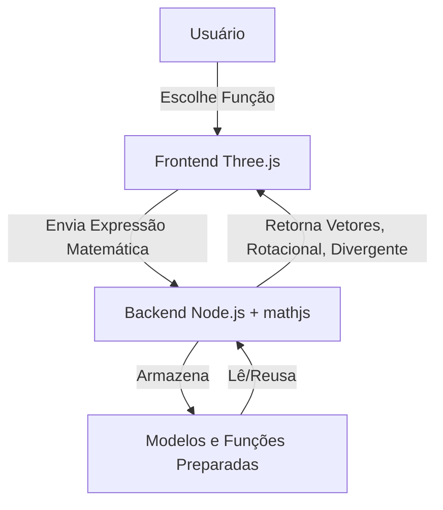

# Simulador Interativo 3D de Campos Vetoriais

**Autores:** SEAL (Lucas Rocha, Kaio Ribeiro, Izac Regis, Gabriel Garcia)  
**Data:** 01 de Dezembro de 2024

---

## Resumo

Este relatório apresenta o desenvolvimento de um simulador interativo 3D de campos vetoriais, como parte do projeto final da disciplina de Cálculo 2. Com o objetivo de integrar conceitos matemáticos fundamentais com visualização computacional, utilizamos uma arquitetura baseada em *Node.js* no backend e *Three.js* no frontend para permitir a exploração visual de campos vetoriais, cálculo de linhas de fluxo e representação gráfica de quantidades como rotacional e divergente. Além disso, apresentamos os fundamentos matemáticos utilizados, sua implementação computacional e exemplos resolvidos que validam o funcionamento correto do sistema.

---

## 1. Introdução

### 1.1 Objetivo do Projeto
O objetivo deste projeto é desenvolver um simulador interativo que apresente campos vetoriais tridimensionais. Os usuários poderão visualizar vetores em diferentes regiões do espaço, acompanhar o comportamento de partículas segundo o campo (linhas de fluxo) e calcular propriedades como divergente e rotacional.

### 1.2 Motivação e Relevância
Campos vetoriais são fundamentais em áreas como física, engenharia e computação gráfica. Entretanto, sua visualização pode ser abstrata para estudantes que ainda estão aprendendo conceitos como rotacional, divergente e integrais de linha. Um simulador que una matemática e computação oferece uma forma dinâmica e intuitiva de explorar tais conceitos.

### 1.3 Público-alvo e Aplicações
Este simulador foi projetado como ferramenta educacional para estudantes e professores de cálculo vetorial, ou para engenheiros/desenvolvedores que desejam modelar sistemas em 3D com base em campos dinâmicos.

## 2. Fundamentação Matemática

### 2.1 Campo Vetorial em $\mathbb{R}^3$
Um campo vetorial tridimensional pode ser definido como:

$$
\vec{F}(x,y,z) = \left(P(x,y,z), Q(x,y,z), R(x,y,z)\right)
$$

onde $P$, $Q$ e $R$ são funções escalares contínuas que atribuem um vetor a cada ponto do espaço $(x,y,z)$.

### 2.2 Linhas de Fluxo
As linhas de fluxo são curvas que em cada ponto são tangentes ao campo vetorial. Elas são definidas como a solução da equação diferencial:

$$
\frac{d\vec{r}(t)}{dt} = \vec{F}(\vec{r}(t))
$$

onde $\vec{r}(t) = (x(t), y(t), z(t))$ representa a trajetória da partícula no campo. No simulador, essas linhas podem ser animadas visualmente.

### 2.3 Curvas Paramétricas
Uma curva paramétrica é uma função que mapeia um intervalo $I \subset \mathbb{R}$ para o espaço:

$$
\vec{r}(t) = (x(t), y(t), z(t)), \quad t \in [a, b]
$$

### 2.4 Integral de Linha
A integral de linha de um campo vetorial ao longo de uma curva $C$ é dada por:

$$
\int_C \vec{F} \cdot d\vec{r} = \int_a^b \vec{F}(\vec{r}(t)) \cdot \vec{r}'(t)\, dt
$$

Ela representa o trabalho realizado por uma força ao longo de um caminho, sendo implementada no backend como uma integral numérica.

### 2.5 Divergente
O divergente de um campo vetorial mede a taxa de expansão ou compressão no ponto:

$$
\text{div}\,\vec{F} = \frac{\partial P}{\partial x} + \frac{\partial Q}{\partial y} + \frac{\partial R}{\partial z}
$$

### 2.6 Rotacional
O rotacional representa a tendência de rotação de um campo:

$$
\text{rot}\,\vec{F} = \nabla \times \vec{F} = \left(
\frac{\partial R}{\partial y} - \frac{\partial Q}{\partial z},\ 
\frac{\partial P}{\partial z} - \frac{\partial R}{\partial x},\ 
\frac{\partial Q}{\partial x} - \frac{\partial P}{\partial y}
\right)
$$

## 3. Exemplos Resolvidos

### 3.1 Campo Radial
Considere o campo vetorial:

$$
\vec{F}(x, y, z) = (x, y, z)
$$

O seu divergente é:

$$
\text{div}\,\vec{F} = 1 + 1 + 1 = 3
$$

### 3.2 Campo de Rotação
Considere:

$$
\vec{F}(x, y, z) = (-y, x, 0)
$$

O rotacional deste campo é:

$$
\text{rot}\,\vec{F} = (0, 0, 2)
$$

### 3.3 Integral de Linha
Calcule a integral ao longo da circunferência:

$$
\vec{r}(t) = (\cos t, \sin t, 0), \quad 0 \le t \le 2\pi
$$

para o campo $\vec{F}(x,y,z) = (-y, x, 0)$:

$$
\vec{F}(\vec{r}(t)) = (-\sin t, \cos t, 0)
$$
$$
\vec{r}'(t) = (-\sin t, \cos t, 0)
$$
$$
\int_0^{2\pi} \vec{F} \cdot \vec{r}'(t)\, dt
= \int_0^{2\pi} (\sin^2 t + \cos^2 t)\, dt
= \int_0^{2\pi} 1\, dt
= 2\pi
$$

## 4. Arquitetura da Aplicação

### 4.1 Visão Geral
A aplicação foi desenvolvida em uma arquitetura separada entre frontend e backend:
*   **Backend (Node.js)**: processa funções vetoriais e calcula derivadas e integrais.
*   **Frontend (Three.js)**: renderiza vetores e anima partículas em 3D.

### 4.2 Fluxo de Dados

## 5. Implementação

### 5.1 Backend Matemático
O backend recebe expressões matemáticas como `"(x*y*z, x*z, y*z)"` e as converte em funções JavaScript. Para derivadas, utilizamos o módulo `mathjs`.

### 5.2 Renderização 3D
No frontend, vetores são representados por setas 3D usando a classe `THREE.ArrowHelper`. Propriedades como cor, tamanho e animação são ajustadas de acordo com o valor de divergente/rotacional no ponto.

## 6. Resultados e Demonstrações
*   Representação de campo radial com coloração dependente do divergente.
*   Partículas animadas seguindo linhas de fluxo.

## 7. Conclusão
Este projeto permitiu integrar os conceitos de Cálculo 2 com técnicas modernas de visualização em 3D e backend em Node.js. O simulador oferece um ambiente interativo que pode ser expandido para incluir mais cálculos, como teoremas de Stokes/Gauss.

### 7.1 Trabalhos Futuros
*   Suporte para superfícies paramétricas.
*   Integração com WebGPU para renderização acelerada.
*   Exportação automática de cálculos como PDF.

## Referências
1.  J. Stewart, *Calculus: Early Transcendentals*. Cengage Learning, 2015.
2.  [Three.js Documentation](https://threejs.org/docs)
3.  [Math.js Documentation](https://mathjs.org/)